# Laporan Jarkom Modul 2 Kelompok K-36

## Anggota

| Nama | NRP|
|-------------------------------|---------------|
| Ahmad Wildan Fawwaz| 5027241001 |
| Muhammad Rakha Hananditya R.| 5027241015 |

## Asisten Penguji
| Nama | Kode Asisten |
|-----------------------|----|
| Athalla Barka Fadhil | P7 |

## Pendahuluan

بِسْمِ اللَّهِ الرَّحْمَنِ الرَّحِيْمِ

<p align="justify">
&emsp; Segala puji syukur kita panjatkan atas kehadirat Allah Subḥānahu wa Ta‘ālā, karena berkat atas rahmat, karunia, dan nikmat-Nya praktikum modul 1 untuk mata kuliah Komunikasi Data dan Jaringan Komputer dapat diselesaikan dengan cukup. Tidak lupa shalawat serta salam semoga senantiasa tercurah kepada junjungan kita Nabi Muhammad Shallallāhu ‘alaihi wa Sallam, suri teladan terbaik bagi umat manusia, beserta keluarga, sahabat, dan para pengikutnya hingga akhir zaman.
</p>

<p align="justify">
&emsp; Laporan ini disusun sebagai suatu bentuk pertanggungjawaban akademik atas kegiatan praktikum yang telah dilaksanakan. Selain itu, laporan ini berfungsi sebagai dokumentasi resmi tertulis dari seluruh rangkaian kegiatan yang telah dilakukan, sehingga dapat menjadi acuan dalam evaluasi maupun penilaian praktikum.
</p>

Rasulullah Shallallāhu ‘alaihi wa Sallam pernah bersabda:

إِذَا مَاتَ ابْنُ آدَمَ انْقَطَعَ عَمَلُهُ إِلَّا مِنْ ثَلَاثٍ: صَدَقَةٍ جَارِيَةٍ، أَوْ عِلْمٍ يُنْتَفَعُ بِهِ، أَوْ وَلَدٍ صَالِحٍ يَدْعُو لَهُ


<em>Artinya</em>:
<p align="justify">
"Apabila anak Adam meninggal dunia, maka terputuslah amalnya kecuali tiga perkara: sedekah jariyah, ilmu yang bermanfaat, atau anak shalih yang mendoakannya." 
<br>
(HR. Muslim, no. 1631)
</p>
  
وَمَنْ سَلَكَ طَرِيقًا يَلْتَمِسُ فِيهِ عِلْمًا سَهَّلَ اللَّهُ لَهُ بِهِ طَرِيقًا إِلَى الْجَنَّةِ

<em>Artinya</em>:
<p align="justify">
"Barang siapa yang menempuh jalan untuk mencari ilmu, maka Allah akan mudahkan baginya jalan menuju surga." 
 <br>
(HR. Muslim, no. 2699)
</p>
  
<p align="justify">
&emsp; Maka dari itu, semoga apa yang tertulis pada laporan ini dapat menjadi ilmu yang bermanfaat, serta menjadi keberkahan dan amal yang diterima di sisi Allah Subḥānahu wa Ta‘ālā. Semoga bagi yang membaca ini, Allah memudahkan semua langkahnya dalam menuntut ilmu, mengamalkannya, serta menjaganya agar tidak sekadar menjadi hafalan, namun juga menjadi bekal yang membawanya ke surga.
</p>

Āmīn yā Rabbal ‘ālamīn.

## Daftar Isi

- [Anggota](#anggota)
- [Pendahuluan](#pendahuluan)
- [Daftar Isi](#daftar-isi)
- [Walkthrough](#walkthrough)
	- [Soal 1](#-soal-1)
	- [Soal 2](#-soal-2)
 	- [Soal 3](#-soal-3)
  	- [Soal 4](#-soal-4)
  	- [Soal 5](#-soal-5)
  	- [Soal 6](#-soal-6)
  	- [Soal 7](#-soal-7)
  	- [Soal 8](#-soal-8)
  	- [Soal 9](#-soal-9)
  	- [Soal 10](#-soal-10)
  	- [Soal 11](#-soal-11)
  	- [Soal 12](#-soal-12)
  	- [Soal 13](#-soal-13)
  	- [Soal 14](#-soal-14)
  	- [Soal 15](#-soal-15)
  	- [Soal 16](#-soal-16)
  	- [Soal 17](#-soal-17)
  	- [Soal 18](#-soal-18)
  	- [Soal 19](#-soal-19)
  	- [Soal 20](#-soal-20)
- [Kendala Pengerjaan](#kendala-pengerjaan)
- [Revisi](#revisi)

## Walkthrough

### • Soal 1

<blockquote>
	<ol>
		<li>
			<p align="justify">
				Di tepi Beleriand yang porak-poranda, Eonwe merentangkan tiga jalur: Barat untuk Earendil dan Elwing, Timur untuk Círdan, Elrond, Maglor, serta pelabuhan DMZ bagi Sirion, Tirion, Valmar, Lindon, Vingilot. Tetapkan alamat dan default gateway tiap tokoh sesuai glosarium yang sudah diberikan.
			</p>
		</li>
	</ol>
</blockquote>

<p align="justify">
&emsp; Untuk mendefinisikan dan mengatur alamat dan default gateway, maka kita dapat beralih ke menu <code>Configure > Edit Network Configuration</code> untuk setiap node yang ada.
</p>

<p align="center">
	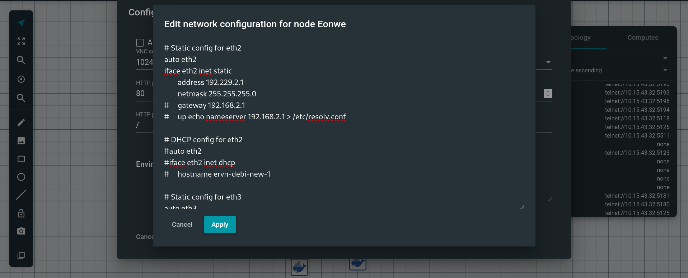  
</p>

Di mana ketentuan untuk setiap nodenya:
1. **Eonwe**
```bash
auto eth0
iface eth0 inet dhcp

auto eth1
iface eth1 inet static
    address 192.229.1.1
    netmask 255.255.255.0

auto eth2
iface eth2 inet static
    address 192.229.2.1
    netmask 255.255.255.0

auto eth3
iface eth3 inet static
    address 192.229.3.1
    netmask 255.255.255.0
```

2. **Earendil**

```bash
auto eth0
iface eth0 inet static
	address 192.229.1.100
	netmask 255.255.255.0
	gateway 192.229.1.1
```

3. **Elwing**

```bash
auto eth0
iface eth0 inet static
	address 192.229.1.101
	netmask 255.255.255.0
	gateway 192.229.1.1
```

4. **Cirdan**

```bash
auto eth0
iface eth0 inet static
	address 192.229.2.100
	netmask 255.255.255.0
	gateway 192.229.2.1
```

5. **Elrond**

```bash
auto eth0
iface eth0 inet static
	address 192.229.2.101
	netmask 255.255.255.0
	gateway 192.229.2.1
```

6. **Maglor**

```bash
auto eth0
iface eth0 inet static
	address 192.229.2.102
	netmask 255.255.255.0
	gateway 192.229.2.1
```

7. **Sirion**

```bash
auto eth0
iface eth0 inet static
	address 192.229.3.100
	netmask 255.255.255.0
	gateway 192.229.3.1
```

8. **Tirion**

```bash
auto eth0
iface eth0 inet static
	address 192.229.3.101
	netmask 255.255.255.0
	gateway 192.229.3.1
```

9. **Valmar**

```bash
auto eth0
iface eth0 inet static
	address 192.229.3.102
	netmask 255.255.255.0
	gateway 192.229.3.1
```

10. **Lindon**

```bash
auto eth0
iface eth0 inet static
	address 192.229.3.103
	netmask 255.255.255.0
	gateway 192.229.3.1
```

11. **Vingilot**

```bash
auto eth0
iface eth0 inet static
	address 192.229.3.104
	netmask 255.255.255.0
	gateway 192.229.3.1
```

### • Soal 2

<blockquote>
	<ol start="2">
		<li>
			<p align="justify">
				Angin dari luar mulai berhembus ketika Eonwe membuka jalan ke awan NAT. Pastikan jalur WAN di router aktif dan NAT meneruskan trafik keluar bagi seluruh alamat internal sehingga host di dalam dapat mencapai layanan di luar menggunakan IP address.
			</p>
		</li>
	</ol>
</blockquote>

<p align="justify">
&emsp; Pada kasus persoalan ini, untuk meneruskan trafik keluar bagi seluruh alamat internal, tidak perlu menjalankan command <code>IPTABLES</code>. Maka dari itu, untuk dapat menyelesaikan soal ini, kita hanya perlu melakukan <code>ping</code> ke <code>google.com</code>.
</p>

<p align="center">
	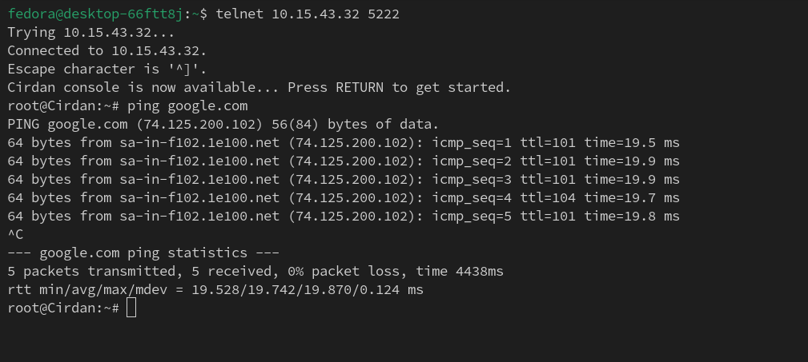  
</p>

### • Soal 3

<blockquote>
	<ol start="3">
		<li>
			<p align="justify">
				Kabar dari Barat menyapa Timur. Pastikan kelima klien dapat saling berkomunikasi lintas jalur (routing internal via Eonwe berfungsi), lalu pastikan setiap host non-router menambahkan resolver 192.168.122.1 saat interfacenya aktif agar akses paket dari internet tersedia sejak awal.
			</p>
		</li>
	</ol>
</blockquote>

<p align="justify">
&emsp; Untuk menambahkan resolver <code>192.168.122.1</code>, maka kita dapat kembali beralih ke menu <code>Configure > Edit Network Configuration</code> untuk setiap node non-router yang ada dan menambahkan <code>up sh -c 'echo "nameserver 192.168.122.1" > /etc/resolv.conf'</code> setelah mendefinisikan address dan default gateway. Sehingga keseluruhan konfigurasinya, dengan menggunakan <b>Maglor</b> sebagai contoh, adalah:
</p>

```bash
auto eth0
iface eth0 inet static
	address 192.229.2.102
	netmask 255.255.255.0
	gateway 192.229.2.1
	up sh -c 'echo "nameserver 192.168.122.1" > /etc/resolv.conf'
```

### • Soal 4

<blockquote>
	<ol start="4">
		<li>
			<p align="justify">
				Para penjaga nama naik ke menara, di Tirion (ns1/master) bangun zona &lt;xxxx&gt;.com sebagai authoritative dengan SOA yang menunjuk ke ns1.&lt;xxxx&gt;.com dan catatan NS untuk ns1.&lt;xxxx&gt;.com dan ns2.&lt;xxxx&gt;.com. Buat A record untuk ns1.&lt;xxxx&gt;.com dan ns2.&lt;xxxx&gt;.com yang mengarah ke alamat Tirion dan Valmar sesuai glosarium, serta A record apex &lt;xxxx&gt;.com yang mengarah ke alamat Sirion (front door), aktifkan notify dan allow-transfer ke Valmar, set forwarders ke 192.168.122.1. Di Valmar (ns2/slave) tarik zona &lt;xxxx&gt;.com dari Tirion dan pastikan menjawab authoritative. pada seluruh host non-router ubah urutan resolver menjadi IP dari ns1.&lt;xxxx&gt;.com → ns2.&lt;xxxx&gt;.com → 192.168.122.1. Verifikasi query ke apex dan hostname layanan dalam zona dijawab melalui ns1/ns2.
			</p>
		</li>
	</ol>
</blockquote>

<p align="justify">
&emsp; Sebelum dapat membuat zona DNS pada Tirion, maka langkah pertama adalah menginstall <b>Bind9</b> pada console <b>Tirion</b> terlebih dahulu. Di mana langkah implementasinya adalah:
</p>

1. Memperbarui daftar package yang ada pada apt-get.

```bash
apt-get update
```

2. Menginstall `bind9`.

```bash
apt-get install bind9 -y
```

3. Membuat link simbolik `/etc/init.d/bind9` yang merujuk ke `/etc/init.d/named`.

```bash
ln -s /etc/init.d/named /etc/init.d/bind9
```

<p align="justify">
&emsp; Kemudian setelah menginstall bind9, kita perlu melakukan konfigurasi domain terlebih dahulu pada file <code>/etc/bind/named.conf.local</code>. Di mana langkah implementasinya adalah:
</p>

4. Membuat file konfigurasi `/etc/bind/named.conf.local` dan menetapkan zona DNS `K36.com` dengan tipe `master` untuk Tirion.

```bash
cat > /etc/bind/named.conf.local <<'EOF'
zone "K36.com" {
        type master;
        file "/etc/bind/ns1/K36.com";
};
EOF
```

5. Membuat direktori `/etc/bind/ns1`.

```bash
mkdir -p /etc/bind/ns1
```

6. Mengalihkan kepemilikan direktori `/etc/bind/ns1` ke user `bind`.
```bash
chown bind:bind /etc/bind/ns1
```

<p align="justify">
Langkah selanjutnya adalah membuat file zona DNS otoritatif pada Tirion, di mana ketentuannya:
	<ul>
		<li>
			Start of Authority (SOA) yang merujuk ke nama domain <code>ns1.K36.com</code>.
		</li>
		<li>
			Nameserver Record (NS) untuk nama domain <code>ns1.K36.com</code> dan <code>ns2.K36.com</code>.
		</li>
		<li>
			Address Record (A) untuk IP address dari node <b>Tirion</b> yang merujuk ke nama domain <code>ns1.K36.com</code>. 
		</li>
		<li>
			Address Record (A) untuk IP address dari node <b>Valmar</b> yang merujuk ke nama domain <code>ns2.K36.com</code>. 
		</li>
		<li>
			Address Record (A) untuk IP address dari node <b>Sirion</b> yang merujuk ke nama domain apex (@) <code>K36.com</code>. 
		</li>
	</ul>
Dengan langkah implementasinya:
</p>

7. Membuat file record zona DNS template pada `/etc/bind/zone.template`.

```bash
cat > /etc/bind/zone.template <<'EOF'
$TTL    604800          ; Waktu cache default (detik)
@       IN      SOA     localhost. root.localhost. (
                        2025100401 ; Serial (format YYYYMMDDXX)
                        604800     ; Refresh (1 minggu)
                        86400      ; Retry (1 hari)
                        2419200    ; Expire (4 minggu)
                        604800 )   ; Negative Cache TTL
;

@       IN      NS      localhost.
@       IN      A       127.0.0.1
EOF
```

8. Menyalin file template ke direktori `/etc/bind/ns1` dengan nama `K36.com`.

```bash
cp /etc/bind/zone.template /etc/bind/ns1/K36.com
```

9. Mengubah isi file template dan menyesuaikannya dengan ketentuan.

```bash
cat > /etc/bind/ns1/K36.com <<'EOF'
$TTL    604800          ; Waktu cache default (detik)
@       IN      SOA     ns1.K36.com. root.K36.com. (
                        2025100401 ; Serial (format YYYYMMDDXX)
                        604800     ; Refresh (1 minggu)
                        86400      ; Retry (1 hari)
                        2419200    ; Expire (4 minggu)
                        604800 )   ; Negative Cache TTL
;

@       IN      NS      ns1.K36.com.
@       IN      NS      ns2.K36.com.

ns1        IN      A       192.229.3.101  ; IP Tirion
ns2        IN      A       192.229.3.102  ; IP Valmar
@          IN      A       192.229.3.100  ; IP Sirion
EOF
```

10. Mendelegasikan wewenang atas sebuah subdomain pada file `/etc/bind/named.conf.options`.

```bash
cat > /etc/bind/named.conf.options <<'EOF'
options {
    directory "/var/cache/bind";

    dnssec-validation no;
    listen-on-v6 { any; };
    allow-query { any; };
    auth-nxdomain no;
};
EOF
```

<p align="justify">
&emsp; Setelah itu, kita perlu mengaktifkan <code>notify</code> dan <code>allow-transfer</code> ke node Valmar, serta menetapkan forwarders ke <code>192.168.122.1</code>. Di mana langkah implementasinya adalah:
</p>

11. Memperbarui file konfigurasi `/etc/bind/named.conf.local` dan menambahkan klausa yang mengaktifkan `notify` dan `allow-transfer` ke node **Valmar**.

```bash
cat > /etc/bind/named.conf.local <<'EOF'
zone "K36.com" {
        type master;
        file "/etc/bind/ns1/K36.com";
        allow-transfer { 192.229.3.102; };
        also-notify { 192.229.3.102; };
        notify yes;
};
EOF
```

12. Memperbarui file `/etc/bind/named.conf.options` dan menambahkan klausa yang menetapkan forwarders ke `192.168.122.1`.

```bash
cat > /etc/bind/named.conf.options <<'EOF'
options {
    directory "/var/cache/bind";

    forwarders {
        192.168.122.1;
    };

    dnssec-validation no;
    listen-on-v6 { any; };
    allow-query { any; };
    auth-nxdomain no;
};
EOF
```

13. Melakukan restart pada service `bind9`.

```bash
service bind9 restart
```

<p align="justify">
&emsp; Selepas itu, kita juga perlu melakukan konfigurasi pada node Valmar. Di mana langkah pertama yang perlu dilakukan adalah menginstall <b>Bind9</b> pada console <b>Valmar</b> terlebih dahulu. Dengan langkah implementasinya adalah:
</p>

14. Memperbaharui daftar package yang ada pada apt-get.

```bash
apt-get update
```

15. Menginstall `bind9`.

```bash
apt-get install bind9 -y
```

16. Membuat link simbolik `/etc/init.d/bind9` yang merujuk ke `/etc/init.d/named`.

```bash
ln -s /etc/init.d/named /etc/init.d/bind9
```

<p align="justify">
&emsp; Kemudian setelah menginstall bind9, kita perlu melakukan konfigurasi domain terlebih dahulu pada file <code>/etc/bind/named.conf.local</code>. Di mana langkah implementasinya adalah:
</p>

17. Membuat file konfigurasi `/etc/bind/named.conf.local` dan menetapkan zona DNS `K36.com` dengan tipe `slave` untuk Valmar.

```bash
cat > /etc/bind/named.conf.local <<'EOF'
zone "K36.com" {
        type slave;
        masters { 192.229.3.101; };
        file "/etc/bind/ns1/K36.com";
};
EOF
```

18. Membuat direktori `/etc/bind/ns1`.

```bash
mkdir -p /etc/bind/ns1
```

19. Mengalihkan kepemilikan direktori `/etc/bind/ns1` ke user `bind`.
```bash
chown bind:bind /etc/bind/ns1
```

20. Melakukan restart pada service `bind9`.

```bash
service bind9 restart
```

<p align="justify">
&emsp; Seterusnya, kita perlu memverifikasi bahwasannya zona <code>K36.com</code> yang ditarik dari Tirion dijawab otoritatif oleh Valmar. Di mana kita dapat melakukannya dengan menjalankan:
</p>

```bash
dig @192.229.3.102 K36.com SOA
```

Di mana:
- `dig`: Utilitas DNS Lookup.
- `@192.229.3.102`: target server dari DNS Lookup, di mana pada kasus ini adalah **Valmar** dengan IP address `192.229.3.102`.
- `K36.com`: target zona domain pada Valmar yang ingin di lookup.
- `SOA`: tipe DNS record yang hendak di lookup. 

<p align="center">
	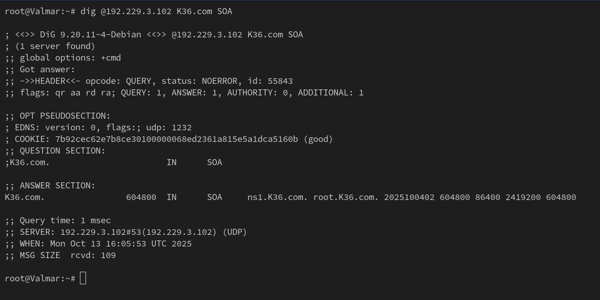  
</p>

<p align="justify">
&emsp; Berdasarkan screenshot di atas, dapat disimpulkan bahwasannya Valmar berhasil menarik zona <code>K36.com</code> dari Tirion dan memiliki hak otoritatif untuk zona tersebut. Hal ini diindikasikan pada output command <code>dig</code>, khususnya pada bagian <code>flags</code> yang menyatakan flag <code>aa</code> atau Authoritative Answer.
</p>

<p align="justify">
&emsp; Terakhir, kita perlu memverifikasi query ke apex dan hostname dijawab melalui ns1 atau ns2. Di mana kita dapat melakukannya dengan menjalankan command <code>dig</code> dengan ketentuan:
</p>

- Untuk apex:

```bash
dig @192.229.3.101 K36.com
dig @192.229.3.102 K36.com

```

- Untuk hostname:

```bash
dig @192.229.3.101 ns1.K36.com
dig @192.229.3.101 ns2.K36.com
```

<p align="center">
	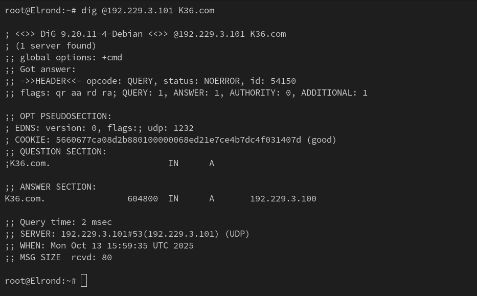  
</p>

<p align="justify">
&emsp; Berdasarkan screenshot di atas, dapat disimpulkan bahwasannya query ke apex dijawab oleh <code>ns1</code>. Hal ini diindikasikan pada output command <code>dig</code>, khususnya pada bagian <code>SERVER</code> yang menyatakan IP address <code>192.229.3.101</code> yang merupakan IP <b>Tirion</b> atau <code>ns1</code>.
</p>

<p align="center">
	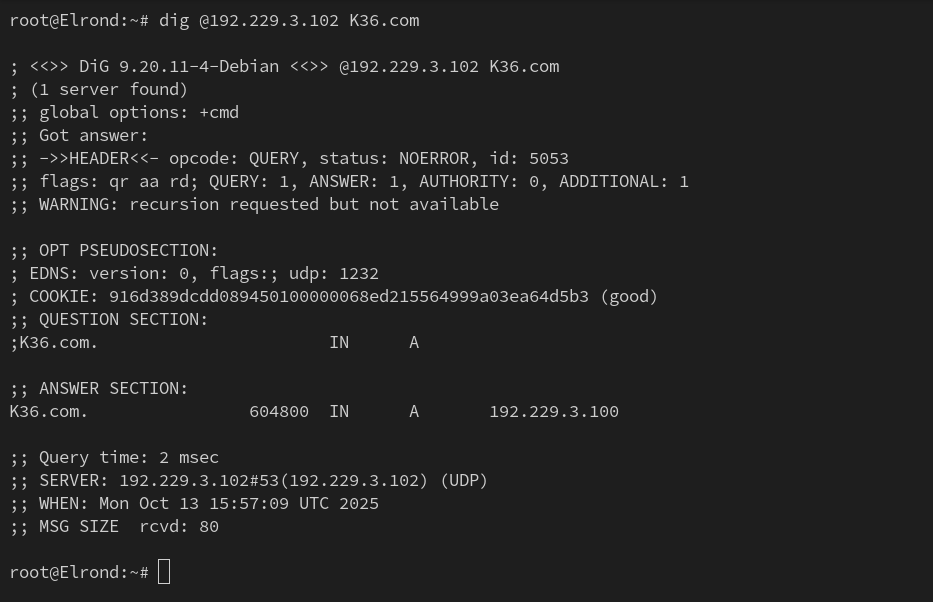  
</p>

<p align="justify">
&emsp; Berdasarkan screenshot di atas, dapat disimpulkan bahwasannya query ke apex dijawab oleh <code>ns2</code>. Hal ini diindikasikan pada output command <code>dig</code>, khususnya pada bagian <code>SERVER</code> yang menyatakan IP address <code>192.229.3.102</code> yang merupakan IP <b>Valmar</b> atau <code>ns2</code>.
</p>

### • Soal 5

<blockquote>
	<ol start="5">
		<li>
			<p align="justify">
				“Nama memberi arah”, kata Eonwe. Namai semua tokoh (hostname) sesuai glosarium, eonwe, earendil, elwing, cirdan, elrond, maglor, sirion, tirion, valmar, lindon, vingilot, dan verifikasi bahwa setiap host mengenali dan menggunakan hostname tersebut secara system-wide. Buat setiap domain untuk masing masing node sesuai dengan namanya (contoh: eru.&lt;xxxx&gt;.com) dan assign IP masing-masing juga. Lakukan pengecualian untuk node yang bertanggung jawab atas ns1 dan ns2.
			</p>
		</li>
	</ol>
</blockquote>

<p align="justify">
&emsp; Langkah pertama adalah mengganti nama dari setiap node supaya sesuai dengan yang ada pada glosarium. Hal ini dapat dilakukan dengan cara beralih ke menu <code>Change Hostname</code> dan mengganti namanya untuk setiap node. Untuk memverifikasi bahwa setiap node mengenali dan menggunakan hostname tersebut, maka kita dapat melakukannya dengan menjalankan command <code>hostname</code> pada setiap node. Menggunakan <b>Elrond</b> dan <b>Cirdan</b> sebagai contoh:
</p>

<p align="center">
	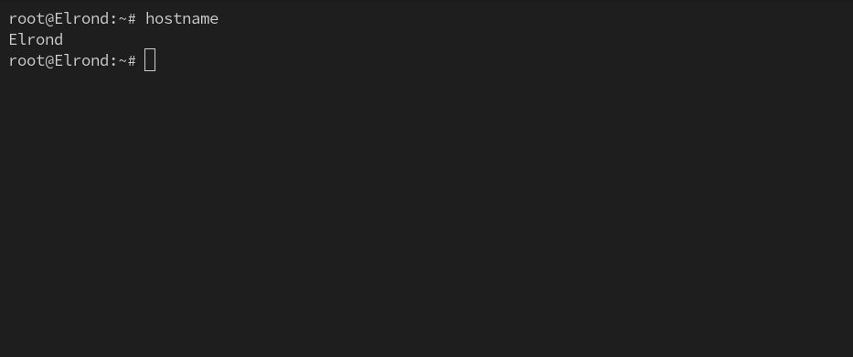  
</p>

<p align="center">
	  
</p>

<p align="justify">
&emsp; Setelah itu, kita perlu menambahkan Address Record (A) untuk IP address dari node selain Tirion dan Valmar yang merujuk ke nama domain yang sejalan dengan nama node tersebut. Di mana langkah implementasinya adalah:
</p>

1. Memperbarui file `/etc/bind/ns1/K36.com` dan menambahkan klausa Address Record (A) untuk setiap node selain Tirion dan Valmar.

```bash
cat > /etc/bind/ns1/K36.com <<'EOF'
$TTL    604800          ; Waktu cache default (detik)
@       IN      SOA     ns1.K36.com. root.K36.com. (
                        2025100401 ; Serial (format YYYYMMDDXX)
                        604800     ; Refresh (1 minggu)
                        86400      ; Retry (1 hari)
                        2419200    ; Expire (4 minggu)
                        604800 )   ; Negative Cache TTL
;

@       IN      NS      ns1.K36.com.
@       IN      NS      ns2.K36.com.

ns1        IN      A       192.229.3.101  ; IP Tirion
ns2        IN      A       192.229.3.102  ; IP Valmar
@          IN      A       192.229.3.100  ; IP Sirion
eonwe      IN      A       192.229.1.1
earendil   IN      A       192.229.1.100
elwing     IN      A       192.229.1.101
cirdan     IN      A       192.229.2.100
elrond     IN      A       192.229.2.101
maglor     IN      A       192.229.2.102
sirion     IN      A       192.229.3.100
lindon     IN      A       192.229.3.103
vingilot   IN      A       192.229.3.104
EOF
```

2. Memperbarui serial dari SOA file `/etc/bind/ns1/K36.com` dari yang awalnya bernilai `2025100401` menjadi `2025100402`.

<p align="center">
	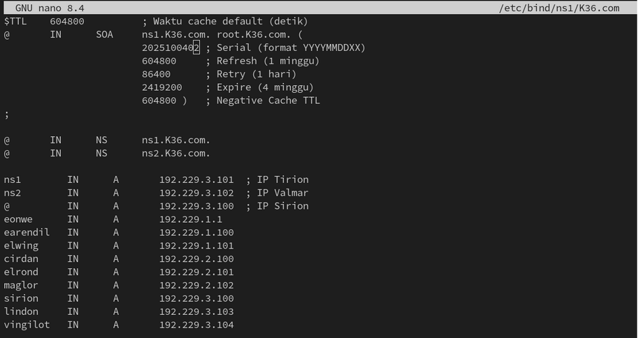  
</p>

3. Melakukan restart pada service `bind9`.

```bash
service bind9 restart
```

### • Soal 6

<blockquote>
	<ol start="6">
		<li>
			<p align="justify">
				Lonceng Valmar berdentang mengikuti irama Tirion. Pastikan zone transfer berjalan, Pastikan Valmar (ns2) telah menerima salinan zona terbaru dari Tirion (ns1). Nilai serial SOA di keduanya harus sama.
			</p>
		</li>
	</ol>
</blockquote>

<p align="justify">
&emsp; Untuk mengetahui apakah Valmar atau <code>ns2</code> telah menerima salinan zona dari Tirion atau <code>ns1</code>, maka kita dapat menggunakan command <code>dig</code> dengan ketentuan:
</p>

```bash
dig @192.229.3.102 K36.com SOA
```

Di mana:
- `dig`: Utilitas DNS Lookup.
- `@192.229.3.102`: target server dari DNS Lookup, di mana pada kasus ini adalah **Valmar** dengan IP address `192.229.3.102`.
- `K36.com`: target zona domain pada Valmar yang ingin di lookup.
- `SOA`: tipe DNS record yang hendak di lookup.

<p align="center">
	  
</p>

<p align="justify">
&emsp; Berdasarkan screenshot di atas, dapat disimpulkan bahwasannya Valmar berhasil menerima salinan zona dari Tirion. Hal ini diindikasikan pada output command <code>dig</code>, khususnya pada bagian <code>ANSWER SECTION</code> di mana terdapat serial SOA yang telah diperbarui, yakni <code>2025100402</code>. 
</p>

### • Soal 7

<blockquote>
	<ol start="7">
		<li>
			<p align="justify">
				Peta kota dan pelabuhan dilukis. Sirion sebagai gerbang, Lindon sebagai web statis, Vingilot sebagai web dinamis. Tambahkan pada zona &lt;xxxx&gt;.com A record untuk sirion.&lt;xxxx&gt;.com (IP Sirion), lindon.&lt;xxxx&gt;.com (IP Lindon), dan vingilot.&lt;xxxx&gt;.com (IP Vingilot). Tetapkan CNAME:
				<ul>
					<li>www.&lt;xxxx&gt;.com → sirion.&lt;xxxx&gt;.com,</li>
					<li>static.&lt;xxxx&gt;.com → lindon.&lt;xxxx&gt;.com, dan</li>
					<li>app.&lt;xxxx&gt;.com → vingilot.&lt;xxxx&gt;.com.</li>
				</ul>
Verifikasi dari dua klien berbeda bahwa seluruh hostname tersebut ter-resolve ke tujuan yang benar dan konsisten.
			</p>
		</li>
	</ol>
</blockquote>

<p align="justify">
&emsp; Langkah pertama adalah menambahkan Canonical Name Record (CNAME) atau suatu alias untuk masing-masing nama domain <code>sirion.K36.com</code>, <code>lindon.K36.com</code>, dan <code>vingilot.K36.com</code>. Di mana langkah implementasinya:
</p>

1. Memperbarui file `/etc/bind/ns1/K36.com` dan menambahkan klausa Canonical Name Record (CNAME) untuk nama domain node Sirion, Lindon, dan Vingilot:

```bash
cat > /etc/bind/ns1/K36.com <<'EOF'
$TTL    604800          ; Waktu cache default (detik)
@       IN      SOA     ns1.K36.com. root.K36.com. (
                        2025100402 ; Serial (format YYYYMMDDXX)
                        604800     ; Refresh (1 minggu)
                        86400      ; Retry (1 hari)
                        2419200    ; Expire (4 minggu)
                        604800 )   ; Negative Cache TTL
;

@       IN      NS      ns1.K36.com.
@       IN      NS      ns2.K36.com.

ns1        IN      A       192.229.3.101  ; IP Tirion
ns2        IN      A       192.229.3.102  ; IP Valmar
@          IN      A       192.229.3.100  ; IP Sirion
eonwe      IN      A       192.229.1.1
earendil   IN      A       192.229.1.100
elwing     IN      A       192.229.1.101
cirdan     IN      A       192.229.2.100
elrond     IN      A       192.229.2.101
maglor     IN      A       192.229.2.102
sirion     IN      A       192.229.3.100
lindon     IN      A       192.229.3.103
vingilot   IN      A       192.229.3.104

www     IN      CNAME   sirion.K36.com.
static  IN      CNAME   lindon.K36.com.
app     IN      CNAME   vingilot.K36.com.
EOF
```

2. Memperbarui serial dari SOA file `/etc/bind/ns1/K36.com` dari yang awalnya bernilai `2025100402` menjadi `2025100403`.

3. Melakukan restart pada service `bind9`.

```bash
service bind9 restart
```

<p align="justify">
&emsp; Terakhir, kita perlu memverifikasi bahwasannya seluruh hostname tersebut berhasil ter-resolve ke tujuan yang benar dan konsisten. Di mana hal ini dapat dilakukan dengan menjalankan command <code>host</code> untuk setiap Canonical Name Record (CNAME). Menggunakan <b>Elrond</b> dan <b>Cirdan</b> sebagai contoh:
</p>

<p align="center">
	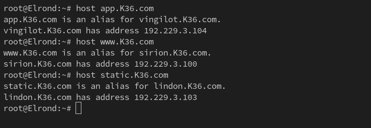  
</p>

<p align="center">
	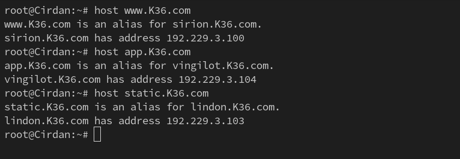  
</p>

<p align="justify">
&emsp; Berdasarkan kedua screenshot di atas dapat disimpulkan bahwasannya masing-masing dari CNAME Record sudah berhasil ter-resolve ke tujuan yang benar dan konsisten pada setidaknya dua klien.
</p>

### • Soal 8

<blockquote>
	<ol start="8">
		<li>
			<p align="justify">
				Setiap jejak harus bisa diikuti. Di Tirion (ns1) deklarasikan satu reverse zone untuk segmen DMZ tempat Sirion, Lindon, Vingilot berada. Di Valmar (ns2) tarik reverse zone tersebut sebagai slave, isi PTR untuk ketiga hostname itu agar pencarian balik IP address mengembalikan hostname yang benar, lalu pastikan query reverse untuk alamat Sirion, Lindon, Vingilot dijawab authoritative.
			</p>
		</li>
	</ol>
</blockquote>

<p align="justify">
&emsp; Supaya dapat membuat zona Reverse DNS pada Tirion, maka langkah pertama adalah kita perlu memperbarui konfigurasi domain terlebih dahulu pada file <code>/etc/bind/named.conf.local</code>. Di mana langkah implementasinya adalah:
</p>

1. Menambahkan klausa pada file konfigurasi `/etc/bind/named.conf.local` yang menetapkan zona Reverse DNS `3.229.192.in-addr.arpa` dengan tipe `master` untuk Tirion dan mengaktifkan `notify` dan `allow-transfer` ke node **Valmar**.

```bash
cat >> /etc/bind/named.conf.local <<'EOF'

zone "3.229.192.in-addr.arpa" {
        type master;
        file "/etc/bind/ns1/3.229.192.in-addr.arpa";
        allow-transfer { 192.229.3.102; };
        also-notify { 192.229.3.102; };
        notify yes;
};
EOF
```

<p align="justify">
Langkah selanjutnya adalah membuat file zona Reverse DNS otoritatif pada Tirion, di mana ketentuannya:
	<ul>
		<li>
			Start of Authority (SOA) yang merujuk ke nama domain <code>ns1.K36.com</code>.
		</li>
		<li>
			Nameserver Record (NS) untuk nama domain <code>ns1.K36.com</code> dan <code>ns2.K36.com</code>.
		</li>
		<li>
			Pointer Record (PTR) untuk nama domain <code>sirion.K36.com</code> yang merujuk ke IP address dari node <b>Sirion</b>. 
		</li>
		<li>
			Pointer Record (PTR) untuk nama domain <code>lindon.K36.com</code> yang merujuk ke IP address dari node <b>Lindon</b>. 
		</li>
		<li>
			Pointer Record (PTR) untuk nama domain <code>vingilot.K36.com</code> yang merujuk ke IP address dari node <b>Vingilot</b>. 
		</li>
	</ul>
Dengan langkah implementasinya:
</p>

2. Menyalin file template ke direktori `/etc/bind/ns1` dengan nama `3.229.192.in-addr.arpa`.

```bash
cp /etc/bind/zone.template /etc/bind/ns1/3.229.192.in-addr.arpa
```

3. Mengubah isi file template dan menyesuaikannya dengan ketentuan.

```bash
cat > /etc/bind/ns1/3.229.192.in-addr.arpa <<'EOF'
$TTL    604800          ; Waktu cache default (detik)
@       IN      SOA     ns1.K36.com. root.K36.com. (
                        2025100401 ; Serial (format YYYYMMDDXX)
                        604800     ; Refresh (1 minggu)
                        86400      ; Retry (1 hari)
                        2419200    ; Expire (4 minggu)
                        604800 )   ; Negative Cache TTL
;

@       IN      NS      ns1.K36.com.
@       IN      NS      ns2.K36.com.

100     IN      PTR     sirion.K36.com.
103     IN      PTR     lindon.K36.com.
104     IN      PTR     vingilot.K36.com.
EOF
```

4. Melakukan restart pada service `bind9`.

```bash
service bind9 restart
```

### • Soal 9

<blockquote>
	<ol start="9">
		<li>
			<p align="justify">
				Lampion Lindon dinyalakan. Jalankan web statis pada hostname <code>static.&lt;xxxx&gt;.com</code> dan buka folder arsip <code>/annals/</code> dengan autoindex (directory listing) sehingga isinya dapat ditelusuri. Akses harus dilakukan melalui hostname, bukan IP.
			</p>
		</li>
	</ol>
</blockquote>

<p align="justify">
&emsp; Pada soal ini, kita akan mengonfigurasi node <b>Lindon</b> sebagai web server statis yang dapat menampilkan isi direktori melalui fitur <b>autoindex</b> dari Nginx. Hostname yang digunakan adalah <code>static.K36.com</code> dan folder arsip yang harus ditampilkan adalah <code>/annals/</code>. Seluruh akses harus dilakukan melalui hostname, bukan IP Address langsung.
</p>

---

## Langkah Implementasi

### 1. Instalasi dan Persiapan Direktori

```bash
apt-get update
apt-get install nginx -y

mkdir -p /var/www/static.K36.com/annals
echo "Ini adalah arsip pertama Lindon." > /var/www/static.K36.com/annals/test.txt
```

---

### 2. Konfigurasi Virtual Host

Buat file konfigurasi baru untuk `static.K36.com`:

```bash
cat > /etc/nginx/sites-available/static.K36.com <<'EOF'
server {
    listen 80;
    server_name static.K36.com;
    root /var/www/static.K36.com;
    index index.html index.htm;

    location /annals/ {
        autoindex on;
        try_files $uri $uri/ =404;
    }

    if ($host != "static.K36.com") {
        return 301 http://static.K36.com$request_uri;
    }
}
EOF
```

Aktifkan konfigurasi dan pastikan tidak ada error:

```bash
ln -sf /etc/nginx/sites-available/static.K36.com /etc/nginx/sites-enabled/
rm -f /etc/nginx/sites-enabled/default
nginx -t && service nginx restart
```

---

### 3. Pembuatan Script Otomatis

Untuk mempermudah, langkah-langkah di atas dapat disatukan dalam satu script di root Lindon.

Buat file `/root/setup-lindon.sh`:

```bash
#!/bin/bash
# Setup Web Statis Lindon (K36)

apt-get update
apt-get install nginx -y

mkdir -p /var/www/static.K36.com/annals
echo "Ini adalah arsip pertama Lindon." > /var/www/static.K36.com/annals/test.txt

cat > /etc/nginx/sites-available/static.K36.com <<'EOF'
server {
    listen 80;
    server_name static.K36.com;
    root /var/www/static.K36.com;
    index index.html index.htm;

    location /annals/ {
        autoindex on;
        try_files $uri $uri/ =404;
    }

    if ($host != "static.K36.com") {
        return 301 http://static.K36.com$request_uri;
    }
}
EOF

ln -sf /etc/nginx/sites-available/static.K36.com /etc/nginx/sites-enabled/
rm -f /etc/nginx/sites-enabled/default

nginx -t && service nginx restart

echo "✅ Web statis static.K36.com berhasil diaktifkan di Lindon."
```

Lalu jalankan script:

```bash
chmod +x /root/setup-lindon.sh
./setup-lindon.sh
```

---

### 4. Konfigurasi DNS

Tambahkan record pada DNS di Tirion (`/etc/bind/ns1/K36.com`):

```dns
lindon  IN  A       192.229.3.103
static  IN  CNAME   lindon.K36.com.
```

Restart service Bind9:

```bash
service bind9 restart
```

---

### 5. Pengujian

Coba akses dari client (misalnya Elrond atau Cirdan):

```bash
ping static.K36.com -c 3
```

Kemudian uji melalui HTTP:

```bash
curl http://static.K36.com/annals/
```

Hasil yang diharapkan:

```html
<html>
<head><title>Index of /annals/</title></head>
<body>
<h1>Index of /annals/</h1><hr><pre><a href="../">../</a>
<a href="test.txt">test.txt</a>
</pre><hr></body>
</html>
```

---

### 6. Verifikasi Akses Melalui Hostname

Coba akses menggunakan IP langsung:

```bash
curl http://192.229.3.103/annals/
```

Hasil yang muncul harus berupa redirect:

```html
<html>
<head><title>301 Moved Permanently</title></head>
<body>
<center><h1>301 Moved Permanently</h1></center>
<hr><center>nginx</center>
</body>
</html>
```

Hal ini menunjukkan bahwa akses hanya diizinkan melalui hostname `static.K36.com`.

---

## Kesimpulan

<p align="justify">
&emsp; Berdasarkan hasil konfigurasi dan pengujian, node <b>Lindon</b> berhasil dijalankan sebagai web statis dengan hostname <code>static.K36.com</code>. Folder <code>/annals/</code> dapat ditelusuri menggunakan fitur <b>autoindex</b>, dan seluruh akses berhasil dibatasi hanya melalui hostname, bukan IP Address. Konfigurasi juga dapat dijalankan secara otomatis menggunakan script <code>setup-lindon.sh</code> yang dibuat di direktori root.
</p>


### • Soal 10

<blockquote>
	<ol start="10">
		<li>
			<p align="justify">
				Vingilot mengisahkan cerita dinamis. Jalankan web dinamis (PHP-FPM) pada hostname <code>app.&lt;xxxx&gt;.com</code> dengan beranda dan halaman <code>about</code>, serta terapkan rewrite sehingga <code>/about</code> berfungsi tanpa akhiran <code>.php</code>. Akses harus dilakukan melalui hostname.
			</p>
		</li>
	</ol>
</blockquote>

<p align="justify">
&emsp; Pada soal ini, kita akan mengonfigurasi node <b>Vingilot</b> sebagai web dinamis menggunakan <b>PHP-FPM</b> dengan Nginx. Web ini akan diakses menggunakan hostname <code>app.K36.com</code> dan memiliki dua halaman utama, yaitu <code>index.php</code> (beranda) dan <code>about.php</code> (halaman tentang). Selain itu, kita perlu mengaktifkan aturan rewrite agar pengguna dapat mengakses <code>/about</code> tanpa perlu menuliskan akhiran <code>.php</code>.
</p>

---

## Langkah Implementasi

### 1. Instalasi dan Persiapan Direktori

```bash
apt-get update
apt-get install nginx php php-fpm -y

mkdir -p /var/www/app.K36.com
cd /var/www/app.K36.com
```

Buat dua file PHP utama:

```bash
cat > /var/www/app.K36.com/index.php <<'EOF'
<!DOCTYPE html>
<html>
<head>
    <title>Vingilot - Home</title>
</head>
<body>
    <h1>Selamat datang di Vingilot</h1>
    <p>Ini adalah halaman utama dari web dinamis K36.</p>
    <a href="/about">Tentang Kami</a>
</body>
</html>
EOF

cat > /var/www/app.K36.com/about.php <<'EOF'
<!DOCTYPE html>
<html>
<head>
    <title>Vingilot - About</title>
</head>
<body>
    <h1>Tentang Vingilot</h1>
    <p>Vingilot adalah kapal Earendil yang berlayar menuju Aman membawa cahaya Silmaril.</p>
    <a href="/">Kembali ke Beranda</a>
</body>
</html>
EOF
```

---

### 2. Konfigurasi Virtual Host

Buat file konfigurasi baru untuk `app.K36.com`:

```bash
cat > /etc/nginx/sites-available/app.K36.com <<'EOF'
server {
    listen 80;
    server_name app.K36.com;
    root /var/www/app.K36.com;
    index index.php;

    location / {
        try_files $uri $uri/ /index.php?$query_string;
    }

    location /about {
        rewrite ^/about$ /about.php last;
    }

    location ~ \.php$ {
        include snippets/fastcgi-php.conf;
        fastcgi_pass unix:/run/php/php-fpm.sock;
    }

    if ($host != "app.K36.com") {
        return 301 http://app.K36.com$request_uri;
    }
}
EOF
```

Aktifkan konfigurasi dan pastikan tidak ada error:

```bash
ln -sf /etc/nginx/sites-available/app.K36.com /etc/nginx/sites-enabled/
rm -f /etc/nginx/sites-enabled/default
nginx -t && service nginx restart
```

---

### 3. Pembuatan Script Otomatis

Untuk mempermudah, langkah-langkah di atas dapat disatukan dalam satu script di root Vingilot.

Buat file `/root/setup-vingilot.sh`:

```bash
#!/bin/bash
# Setup Web Dinamis Vingilot (K36)

apt-get update
apt-get install nginx php php-fpm -y

mkdir -p /var/www/app.K36.com

cat > /var/www/app.K36.com/index.php <<'EOF'
<!DOCTYPE html>
<html>
<head>
    <title>Vingilot - Home</title>
</head>
<body>
    <h1>Selamat datang di Vingilot</h1>
    <p>Ini adalah halaman utama dari web dinamis K36.</p>
    <a href="/about">Tentang Kami</a>
</body>
</html>
EOF

cat > /var/www/app.K36.com/about.php <<'EOF'
<!DOCTYPE html>
<html>
<head>
    <title>Vingilot - About</title>
</head>
<body>
    <h1>Tentang Vingilot</h1>
    <p>Vingilot adalah kapal Earendil yang berlayar menuju Aman membawa cahaya Silmaril.</p>
    <a href="/">Kembali ke Beranda</a>
</body>
</html>
EOF

cat > /etc/nginx/sites-available/app.K36.com <<'EOF'
server {
    listen 80;
    server_name app.K36.com;
    root /var/www/app.K36.com;
    index index.php;

    location / {
        try_files $uri $uri/ /index.php?$query_string;
    }

    location /about {
        rewrite ^/about$ /about.php last;
    }

    location ~ \.php$ {
        include snippets/fastcgi-php.conf;
        fastcgi_pass unix:/run/php/php-fpm.sock;
    }

    if ($host != "app.K36.com") {
        return 301 http://app.K36.com$request_uri;
    }
}
EOF

ln -sf /etc/nginx/sites-available/app.K36.com /etc/nginx/sites-enabled/
rm -f /etc/nginx/sites-enabled/default

nginx -t && service nginx restart
echo "✅ Web dinamis app.K36.com berhasil diaktifkan di Vingilot."
```

Lalu jalankan script:

```bash
chmod +x /root/setup-vingilot.sh
./setup-vingilot.sh
```

---

### 4. Konfigurasi DNS

Tambahkan record pada DNS di Tirion (`/etc/bind/ns1/K36.com`):

```dns
vingilot  IN  A       192.229.3.104
app       IN  CNAME   vingilot.K36.com.
```

Restart service Bind9:

```bash
service bind9 restart
```

---

### 5. Pengujian

Coba akses dari client:

```bash
ping app.K36.com -c 3
```

Lalu akses melalui HTTP:

```bash
curl http://app.K36.com/
```

Hasil yang diharapkan:

```html
<h1>Selamat datang di Vingilot</h1>
```

Uji rewrite rule:

```bash
curl http://app.K36.com/about
```

Hasil yang diharapkan:

```html
<h1>Tentang Vingilot</h1>
```

---

## Kesimpulan

<p align="justify">
&emsp; Berdasarkan hasil konfigurasi dan pengujian, node <b>Vingilot</b> berhasil dijalankan sebagai web dinamis dengan hostname <code>app.K36.com</code>. Web ini memiliki dua halaman (beranda dan tentang) dan mendukung rewrite URL sehingga <code>/about</code> dapat diakses tanpa ekstensi <code>.php</code>. Konfigurasi juga dapat dijalankan otomatis melalui script <code>setup-vingilot.sh</code>.
</p>


### • Soal 11

<blockquote>
	<ol start="11">
		<li>
			<p align="justify">
				Di muara sungai, Sirion berdiri sebagai reverse proxy. Terapkan path-based routing: /static → Lindon dan /app → Vingilot, sambil meneruskan header Host dan X-Real-IP ke backend. Pastikan Sirion menerima www.&lt;xxxx&gt;.com (kanonik) dan sirion.&lt;xxxx&gt;.com, dan bahwa konten pada /static dan /app di-serve melalui backend yang tepat.
			</p>
		</li>
	</ol>
</blockquote>

### • Soal 12

<blockquote>
	<ol start="12">
		<li>
			<p align="justify">
				Ada kamar kecil di balik gerbang yakni /admin. Lindungi path tersebut di Sirion menggunakan Basic Auth, akses tanpa kredensial harus ditolak dan akses dengan kredensial yang benar harus diizinkan.
			</p>
		</li>
	</ol>
</blockquote>

### • Soal 13

<blockquote>
	<ol start="13">
		<li>
			<p align="justify">
				“Panggil aku dengan nama,” ujar Sirion kepada mereka yang datang hanya menyebut angka. Kanonisasikan endpoint, akses melalui IP address Sirion maupun sirion.&lt;xxxx&gt;.com harus redirect 301 ke www.&lt;xxxx&gt;.com sebagai hostname kanonik.
			</p>
		</li>
	</ol>
</blockquote>

### • Soal 14

<blockquote>
	<ol start="14">
		<li>
			<p align="justify">
				Di Vingilot, catatan kedatangan harus jujur. Pastikan access log aplikasi di Vingilot mencatat IP address klien asli saat lalu lintas melewati Sirion (bukan IP Sirion).
			</p>
		</li>
	</ol>
</blockquote>

### • Soal 15

<blockquote>
	<ol start="15">
		<li>
			<p align="justify">
				Pelabuhan diuji gelombang kecil, salah satu klien yakni Elrond menjadi penguji dan menggunakan ApacheBench (ab) untuk membombardir http://www.&lt;xxxx&gt;.com/app/ dan http://www.&lt;xxxx&gt;.com/static/ melalui hostname kanonik. Untuk setiap endpoint lakukan 500 request dengan concurrency 10, dan rangkum hasil dalam tabel ringkas.
			</p>
		</li>
	</ol>
</blockquote>

<p align="justify">
&emsp; Langkah pertama adalah kita perlu menginstall depedensi yang diperlukan untuk melakukan pengujian, di mana pada kasus ini yaitu <b>ApacheBench</b> atau <code>ab</code>. Di mana langkah implementasinya pada <b>Elrond</b> adalah:
</p>

1. Memperbarui daftar package yang ada pada apt-get.

```bash
apt-get update
```

2. Menginstall `apache2-utils`.

```bash
apt-get install apache2-utils -y
```

<p align="justify">
&emsp; Selanjutnya merupakan proses pengujian pada nama domain <code>www.K36.com/app/</code> dan <code>www.K36.com/static/</code> dengan ketentuan <b>500</b> request dan <b>10</b> concurrency. Di mana langkah implementasinya adalah:
</p>

3. Menjalankan command `ab` untuk domain `www.K36.com/static/` dan menyimpannya pada suatu file output.

```bash
ab -n 500 -c 10 http://www.K36.com/static/ > /root/static.out
```

4. Menjalankan command `ab` untuk domain `www.K36.com/app/` dan menyimpannya pada suatu file output.

```bash
ab -n 500 -c 10 http://www.K36.com/app/ > /root/app.out
```

<p align="justify">
&emsp; Setelah itu, kita perlu mengolah keluaran dari <b>ApacheBench</b> dan menyajikannya ke dalam bentuk tabel ringkas. Di mana langkah implementasinya adalah:
</p>

5. Mengambil data yang diperlukan dari keluaran ApacheBench menggunakan command `grep`.

```bash
parse() {
  f="$1"
  r=$(grep -E "Complete requests:" "$f" | awk '{print $3}')
  fr=$(grep -E "Failed requests:" "$f" | awk '{print $3}')
  rps=$(grep -E "Requests per second:" "$f" | awk '{print $4}')
  tpr_mean=$(grep -E "Time per request:" "$f" | head -n1 | awk '{print $4}')
  tpr_conc=$(grep -E "Time per request:" "$f" | tail -n1 | awk '{print $4}')
  transfer=$(grep -E "Transfer rate:" "$f" | awk '{print $(NF-2) " " $(NF-1) " " $NF}')
  echo "$r,$fr,$rps,$tpr_mean,$tpr_conc,$transfer"
}

parse /root/static.out > /root/output.csv
parse /root/app.out >> /root/output.csv
```

6. Menampilkan keluaran data tersebut ke dalam bentuk tabel ringkas menggunakan command `awk`.

```bash
awk -F, 'BEGIN {
    printf "| %-18s | %-18s | %-23s | %-23s | %-23s | %-29s |\n", \
           "Requests", "Failed", "Req/Sec", "Time/Req(ms)", "Transfer(KB/s)", "Note";
    print "|--------------------|--------------------|-------------------------|-------------------------|-------------------------|-------------------------------|";
}
{
    printf "| %-18s | %-18s | %-23s | %-23s | %-23s | %-29s |\n", \
           $1, $2, $3, $4, $5, $6;
}' /root/output.csv
```

<p align="center">
	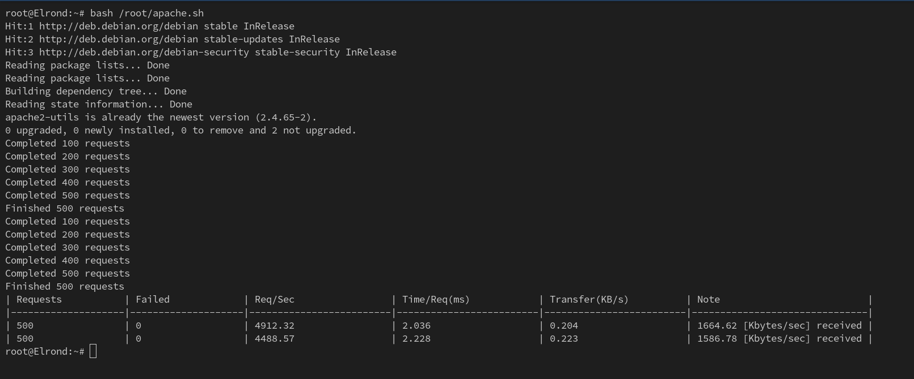  
</p>

### • Soal 16

<blockquote>
	<ol start="16">
		<li>
			<p align="justify">
				Badai mengubah garis pantai. Ubah A record lindon.&lt;xxxx&gt;.com ke alamat baru (ubah IP paling belakangnya saja agar mudah), naikkan SOA serial di Tirion (ns1) dan pastikan Valmar (ns2) tersinkron, karena static.&lt;xxxx&gt;.com adalah CNAME → lindon.&lt;xxxx&gt;.com, seluruh akses ke static.&lt;xxxx&gt;.com mengikuti alamat baru, tetapkan TTL = 30 detik untuk record yang relevan dan verifikasi tiga momen yakni sebelum perubahan (mengembalikan alamat lama), sesaat setelah perubahan namun sebelum TTL kedaluwarsa (masih alamat lama karena cache), dan setelah TTL kedaluwarsa (beralih ke alamat baru).
			</p>
		</li>
	</ol>
</blockquote>

### • Soal 18

<blockquote>
	<ol start="18">
		<li>
			<p align="justify">
				Sang musuh memiliki banyak nama. Tambahkan melkor.&lt;xxxx&gt;.com sebagai record TXT berisi “Morgoth (Melkor)” dan tambahkan morgoth.&lt;xxxx&gt;.com sebagai CNAME → melkor.&lt;xxxx&gt;.com, verifikasi query TXT terhadap melkor dan bahwa query ke morgoth mengikuti aliasnya.
			</p>
		</li>
	</ol>
</blockquote>

<p align="justify">
&emsp; Langkah pertama adalah menambahkan Text Record (TXT) yang berisi <code>"Morgoth (Melkor)"</code> untuk nama domain <code>melkor.K36.com</code>. Di mana langkah implementasinya adalah:
</p>

1. Memperbarui file `/etc/bind/ns1/K36.com` dan menambahkan klausa Text Record (TXT) untuk nama domain `melkor.K36.com`.

```bash
cat > /etc/bind/ns1/K36.com <<'EOF'
$TTL    604800          ; Waktu cache default (detik)
@       IN      SOA     ns1.K36.com. root.K36.com. (
                        2025100403 ; Serial (format YYYYMMDDXX)
                        604800     ; Refresh (1 minggu)
                        86400      ; Retry (1 hari)
                        2419200    ; Expire (4 minggu)
                        604800 )   ; Negative Cache TTL
;

@       IN      NS      ns1.K36.com.
@       IN      NS      ns2.K36.com.

ns1        IN      A       192.229.3.101  ; IP Tirion
ns2        IN      A       192.229.3.102  ; IP Valmar
@          IN      A       192.229.3.100  ; IP Sirion
eonwe      IN      A       192.229.1.1
earendil   IN      A       192.229.1.100
elwing     IN      A       192.229.1.101
cirdan     IN      A       192.229.2.100
elrond     IN      A       192.229.2.101
maglor     IN      A       192.229.2.102
sirion     IN      A       192.229.3.100
lindon     IN      A       192.229.3.103
vingilot   IN      A       192.229.3.104

melkor  IN      TXT     "Morgoth (Melkor)"
EOF
```

2. Memperbarui serial dari SOA file `/etc/bind/ns1/K36.com` dari yang awalnya bernilai `2025100403` menjadi `2025100404`.

<p align="justify">
&emsp; Setelah itu, kita perlu menambahkan Canonical Name Record (CNAME) atau suatu alias untuk nama domain <code>melkor.K36.com</code>. Di mana langkah implementasinya:
</p>

3. Memperbarui file `/etc/bind/ns1/K36.com` dan menambahkan klausa Canonical Name Record (CNAME) untuk nama domain `melkor.K36.com`:

```bash
cat > /etc/bind/ns1/K36.com <<'EOF'
$TTL    604800          ; Waktu cache default (detik)
@       IN      SOA     ns1.K36.com. root.K36.com. (
                        2025100404 ; Serial (format YYYYMMDDXX)
                        604800     ; Refresh (1 minggu)
                        86400      ; Retry (1 hari)
                        2419200    ; Expire (4 minggu)
                        604800 )   ; Negative Cache TTL
;

@       IN      NS      ns1.K36.com.
@       IN      NS      ns2.K36.com.

ns1        IN      A       192.229.3.101  ; IP Tirion
ns2        IN      A       192.229.3.102  ; IP Valmar
@          IN      A       192.229.3.100  ; IP Sirion
eonwe      IN      A       192.229.1.1
earendil   IN      A       192.229.1.100
elwing     IN      A       192.229.1.101
cirdan     IN      A       192.229.2.100
elrond     IN      A       192.229.2.101
maglor     IN      A       192.229.2.102
sirion     IN      A       192.229.3.100
lindon     IN      A       192.229.3.103
vingilot   IN      A       192.229.3.104

www     IN      CNAME   sirion.K36.com.
static  IN      CNAME   lindon.K36.com.
app     IN      CNAME   vingilot.K36.com.

melkor  IN      TXT     "Morgoth (Melkor)"
morgoth IN      CNAME   melkor.K36.com.
EOF
```

4. Memperbarui serial dari SOA file `/etc/bind/ns1/K36.com` dari yang awalnya bernilai `2025100404` menjadi `2025100405`.

5. Melakukan restart pada service `bind9`.

```bash
service bind9 restart
```

<p align="justify">
&emsp; Terakhir, kita perlu memverifikasi bahwasannya query Text (TXT) terhadap <code>melkor.K36.com</code> dan alias untuk nama domain <code>melkor.K36.com</code> berhasil ter-resolve ke tujuan yang benar dan konsisten. Di mana hal ini dapat dilakukan dengan menjalankan command <code>dig</code> untuk query Text (TXT) dan command <code>host</code> untuk query Canonical Name Record (CNAME). Menggunakan <b>Elrond</b> dan <b>Cirdan</b> sebagai contoh:
</p>

<p align="center">
	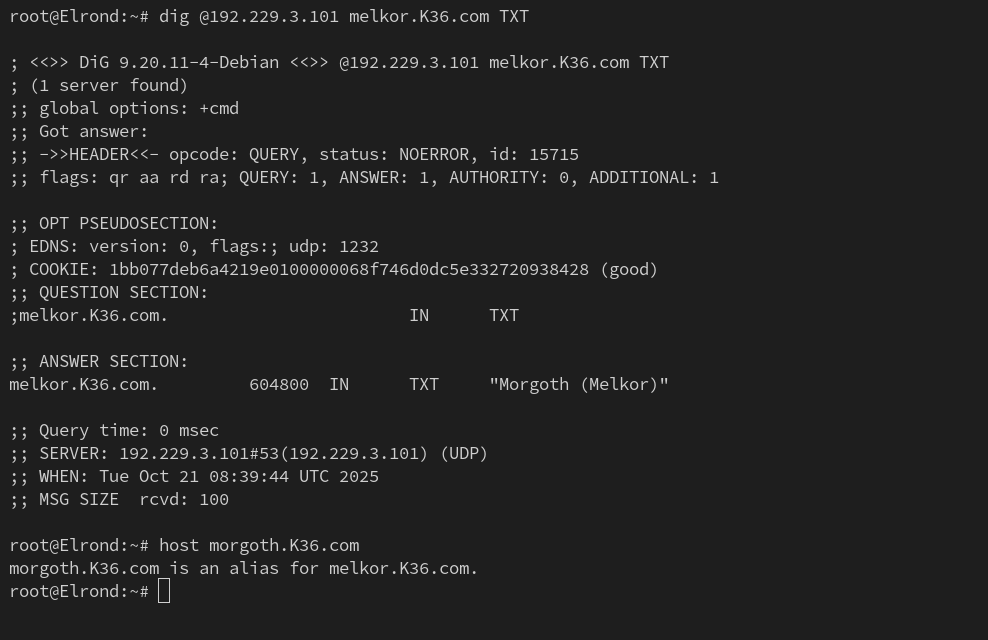  
</p>

<p align="center">
	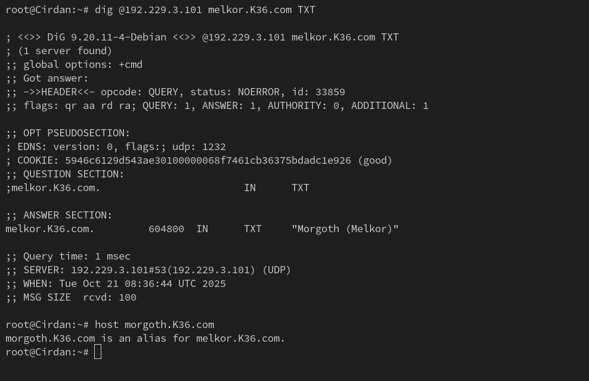  
</p>

<p align="justify">
&emsp; Berdasarkan kedua screenshot di atas dapat disimpulkan bahwasannya masing-masing dari TXT Record dan CNAME Record sudah berhasil ter-resolve ke tujuan yang benar dan konsisten pada setidaknya dua klien.
</p>

### • Soal 19

<blockquote>
	<ol start="19">
		<li>
			<p align="justify">
				Pelabuhan diperluas bagi para pelaut. Tambahkan havens.&lt;xxxx&gt;.com sebagai CNAME → www.&lt;xxxx&gt;.com, lalu akses layanan melalui hostname tersebut dari dua klien berbeda untuk memastikan resolusi dan rute aplikasi berfungsi.
			</p>
		</li>
	</ol>
</blockquote>

<p align="justify">
&emsp; Supaya dapat menambahkan Canonical Name Record (CNAME) untuk <code>www.K36.com</code>, maka kita perlu memperbarui file <code>/etc/bind/ns1/K36.com</code>. Di mana langkah implementasinya adalah:
</p>

1. Memperbarui file `/etc/bind/ns1/K36.com` dan menambahkan klausa Canonical Name Record (CNAME) untuk nama domain `www.K36.com`.

```bash
cat > /etc/bind/ns1/K36.com <<'EOF'
$TTL    604800          ; Waktu cache default (detik)
@       IN      SOA     ns1.K36.com. root.K36.com. (
                        2025100405 ; Serial (format YYYYMMDDXX)
                        604800     ; Refresh (1 minggu)
                        86400      ; Retry (1 hari)
                        2419200    ; Expire (4 minggu)
                        604800 )   ; Negative Cache TTL
;

@       IN      NS      ns1.K36.com.
@       IN      NS      ns2.K36.com.

ns1        IN      A       192.229.3.101  ; IP Tirion
ns2        IN      A       192.229.3.102  ; IP Valmar
@          IN      A       192.229.3.100  ; IP Sirion
eonwe      IN      A       192.229.1.1
earendil   IN      A       192.229.1.100
elwing     IN      A       192.229.1.101
cirdan     IN      A       192.229.2.100
elrond     IN      A       192.229.2.101
maglor     IN      A       192.229.2.102
sirion     IN      A       192.229.3.100
lindon     IN      A       192.229.3.103
vingilot   IN      A       192.229.3.104

www     IN      CNAME   sirion.K36.com.
static  IN      CNAME   lindon.K36.com.
app     IN      CNAME   vingilot.K36.com.

melkor  IN      TXT     "Morgoth (Melkor)"
morgoth IN      CNAME   melkor.K36.com.

havens  IN      CNAME   www.K36.com.
EOF
```

2. Memperbarui serial dari SOA file `/etc/bind/ns1/K36.com` dari yang awalnya bernilai `2025100405` menjadi `2025100406`.

3. Melakukan restart pada service `bind9`.

```bash
service bind9 restart
```

<p align="justify">
&emsp; Terakhir, kita perlu memverifikasi bahwasannya alias untuk nama domain <code>www.K36.com</code> berhasil ter-resolve ke tujuan yang benar dan konsisten. Di mana hal ini dapat dilakukan dengan menjalankan command <code>host</code> untuk query Canonical Name Record (CNAME). Menggunakan <b>Elrond</b> dan <b>Cirdan</b> sebagai contoh:
</p>

<p align="center">
	  
</p>

<p align="center">
	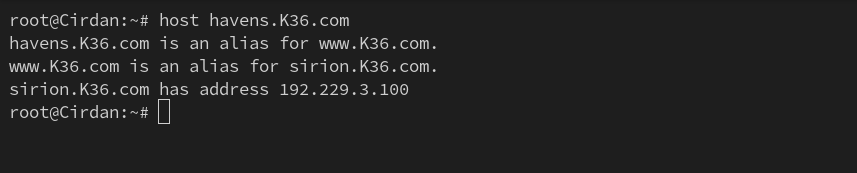  
</p>

<p align="justify">
&emsp; Berdasarkan kedua screenshot di atas dapat disimpulkan bahwasannya CNAME Record sudah berhasil ter-resolve ke tujuan yang benar dan konsisten pada setidaknya dua klien.
</p>

### • Soal 20

<blockquote>
    <ol start="20">
		<li>
			<p align="justify">
				Kisah ditutup di beranda Sirion. Sediakan halaman depan bertajuk “War of Wrath: Lindon bertahan” yang memuat tautan ke /app dan /static. Pastikan seluruh klien membuka beranda dan menelusuri kedua tautan tersebut menggunakan hostname (mis. www.&lt;xxxx&gt;.com), bukan IP address.
			</p>
		</li>
	</ol>
</blockquote>

## Kendala Pengerjaan

<ol>
	<li>
		<p align="justify">
		</p>
	</li>
</ol>

## Revisi

### • Soal 17

<blockquote>
	<ol start="17">
		<li>
			<p align="justify">
				Andaikata bumi bergetar dan semua tertidur sejenak, mereka harus bangkit sendiri. Pastikan layanan inti bind9 di ns1/ns2, nginx di Sirion/Lindon, dan PHP-FPM di Vingilot autostart saat reboot, lalu verifikasi layanan kembali menjawab sesuai fungsinya.
			</p>
		</li>
	</ol>
</blockquote>

<p align="justify">
&emsp; Supaya layanan inti <code>bind9</code>, <code>nginx</code>, dan <code>PHP-FPM</code> dapat berjalan langsung saat reboot di mana pada kasus ini saat node diberhentikan dan dijalankan kembali, maka kita dapat beralih ke menu <code>Configure > Edit Network Configuration</code> untuk setiap node yang bersangkutan. Di mana langkah implementasinya:
</p>

1. Menambahkan `up sh -c 'service bind9 start'` untuk `Tirion` dan `Valmar`.

<p align="center">
	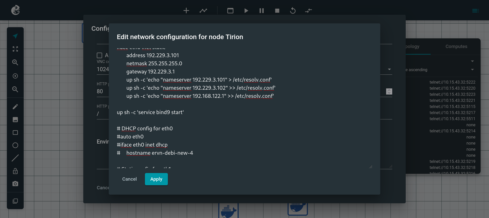  
</p>

2. Memverifikasi bahwasannya layanan `bind9` kembali menjawab sesuai fungsinya.

<p align="center">
	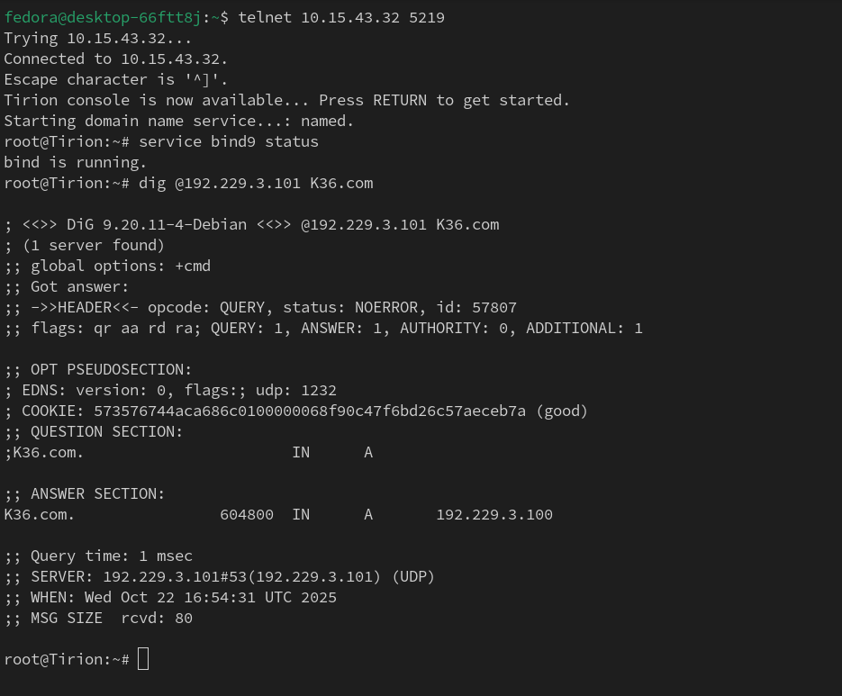  
</p>

3. Menambahkan `up sh -c 'service nginx start'` untuk `Sirion` dan `Lindon`.

<p align="center">
	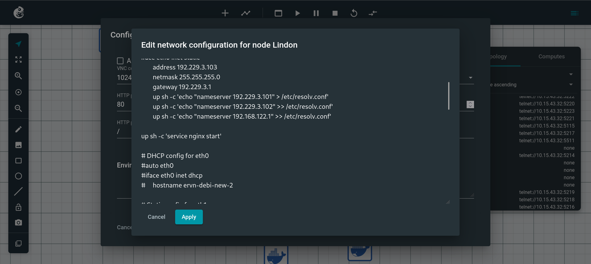  
</p>

4. Memverifikasi bahwasannya layanan `nginx` kembali menjawab sesuai fungsinya.

<p align="center">
	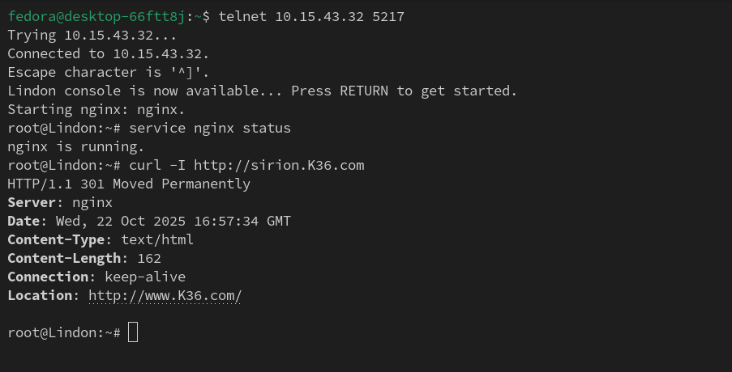  
</p>

5. Menambahkan `up sh -c 'service php8.4-fpm start'` dan `up sh -c 'service nginx start'` untuk `Vingilot`.

<p align="center">
	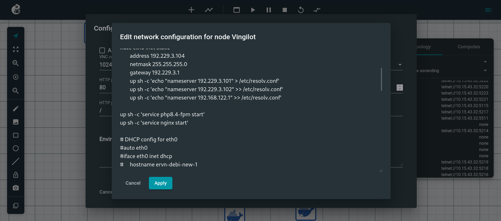  
</p>

6. Memverifikasi bahwasannya layanan `php8.4-fpm` dan `nginx` kembali menjawab sesuai fungsinya.

<p align="center">
	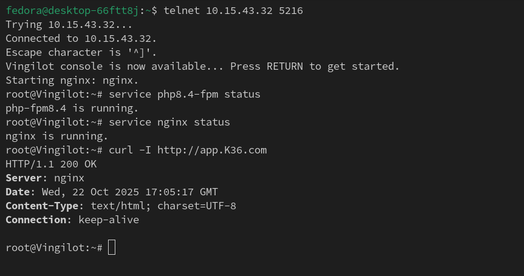  
</p>
